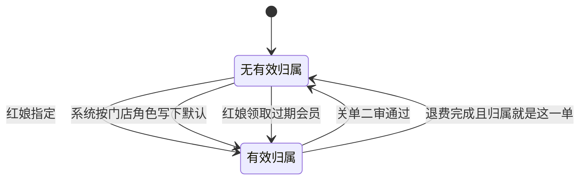
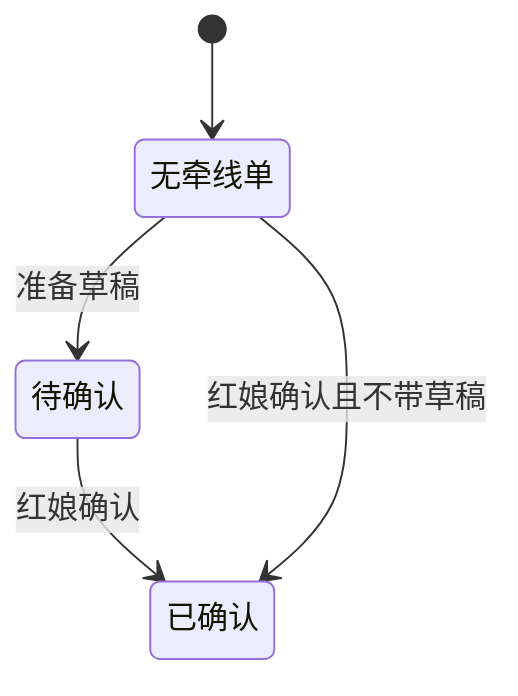
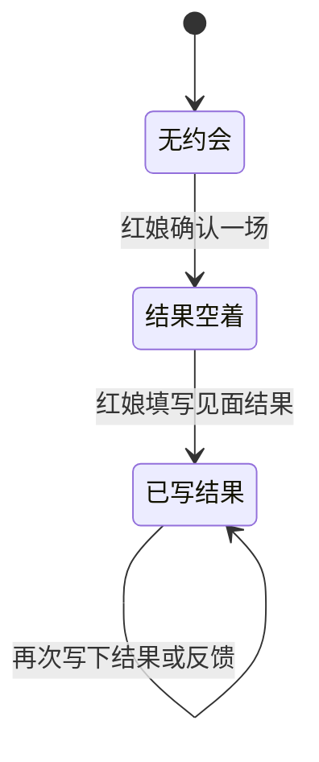
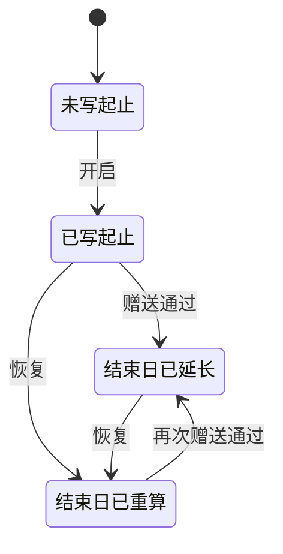

# 四条状态机

服务关系、牵线单、约会单、服务期各记各的。一条上的进度不抄到另一条，也不抄到成熟度。成熟度中间档留空；系统只在开启、暂停通过、关单两级通过时把成熟度写成新升级、暂停、已关单。身份按全部服务实例计算，不是第五条状态机，人也不能改。

服务实例自己的状态是待启用、启用中、暂停、失效、完成。那一列和下面的服务期写在同一行上，但服务期只指出止和次数，不把这五个词再抄成一份进度。

## 服务关系

记在服务归属上：现在有没有一位有效的服务人。来源只说明这一位是怎么来的，不是服务做到哪一步。

指定的来源是「指定」。默认的来源是「默认」，顺序是 matchmanager，然后店长，然后总监；三个都没有就保持无有效归属。红娘领取的来源是「红娘领取」，而且这个人当时必须在过期 VIP 查询里。

## 牵线单

推荐草稿在任务表。推荐事实在推荐表。草稿阶段没有推荐事实。`progress` 只是推荐行上的一段文字，不是另一条状态，也不能拿去改成熟度或约会。

准备草稿要求这个会员已经有有效服务人，并且只能准备该服务人自己名下的会员。确认时写入推荐表；若带了草稿，草稿改为已确认。同一会员和同一嘉宾不能有第二条推荐。

任务表的约束里还有「已关闭」这个词。现有动作不写它，所以它不是从上图走出去的一步。

## 约会单

一场约会一行。结果空着，和结果已经写下，都只发生在这一行。

确认时，对象要么是库内会员，要么有外部姓名。填写时的结果用已见面、未见面、取消、恋爱。恋爱只留在这一行；默认不因此建立关单申请。租户若打开开关，系统另写一张关单申请或一条关单建议，约会行本身的结果不被改成服务进度。

## 服务期

服务期是服务实例上的日期和四类次数，不是成熟度的另一份，也不是把待启用、启用中、暂停、失效、完成再记一遍。

开启写入开始、结束、总结束和四类总量，已用写成 0。暂停通过不进入这张图：实例状态会变成暂停，结束日和总结束日保持不动。恢复时，新的结束日是恢复日加上暂停申请里记下的剩余月；总结束日若比新结束日更晚，就留更晚的那天。赠送通过只延长结束日或总结束日，或增加某一类总量，已用不动，实例状态也不动。

剩余月按日历月算，不满一个月不按天折。代码里的例子是：六个月、开始日 1 月 1 日、2 月最后一天暂停，走完两个月，剩下四个月。

一期没有扣已用的写入。课次不在本期。

## 非法迁移

| 机器 | 不许发生的迁移 | 依据 |
| --- | --- | --- |
| 服务关系 | 销售领取或邀约领取写成一条服务归属 | 这两下只写成交归属，并标明不进服务库 |
| 服务关系 | 没有有效服务人仍把实例开成启用中 | 开启缺服务人就停住 |
| 服务关系 | 不在过期 VIP 查询里仍做红娘领取 | 领取先检查过期名单 |
| 服务关系 | 把成熟度、约会结果或推荐文字写进归属 | 归属只有当前服务人、来源和是否有效 |
| 牵线单 | 还在待确认时就插入推荐事实 | 准备草稿只写任务表 |
| 牵线单 | 确认推荐时改成熟度、改约会或改服务实例 | 确认只写推荐，并在有草稿时把草稿结案 |
| 牵线单 | 同一会员和同一嘉宾再写第二条推荐 | 推荐表有这个唯一约束 |
| 牵线单 | 没有有效服务人，或不是该服务人自己的会员，仍准备草稿 | 准备草稿时的两条检查 |
| 牵线单 | 把待确认改成「已关闭」当成已实现的一步 | 表约束有这个词，现有动作不写 |
| 牵线单 | 用推荐上的进度文字去推进约会或成熟度 | 那段文字不是状态 |
| 约会单 | 对象既没有会员编号，也没有外部姓名 | 约会行的约束 |
| 约会单 | 填写见面结果时改成熟度或改服务实例 | 只更新这一行约会 |
| 约会单 | 结果写成恋爱就让服务实例变成完成 | 恋爱默认只产生关单建议；即便起草关单，也不改约会行以外的进度 |
| 约会单 | 用双方状态去改牵线单 | 双方状态只在约会行上 |
| 服务期 | 暂停通过时修改结束日或总结束日 | 通过只把实例改为暂停 |
| 服务期 | 恢复时把暂停天数加回原来的结束日 | 新结束日是恢复日加上剩余月 |
| 服务期 | 赠送通过时修改已用，或顺手改实例状态 | 只延长日期或增加总量 |
| 服务期 | 扣已用 | 一期没有这个写入；课次不在本期 |
| 服务期 | 另建一张服务期表，再记一份起止或次数 | 起止和次数就在服务实例上 |
| 服务期 | 用成熟度中间档表示服务期走到哪 | 中间档留空，不和日期对照 |
| 服务期 | 把待启用、启用中、暂停、失效、完成抄成服务期的状态 | 那五个词是实例状态，不是服务期 |
| 四条都不许 | 把算出来的身份再做成一条会迁移的状态 | 身份只读服务实例，缓存列不能手改 |
